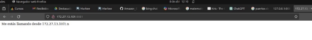
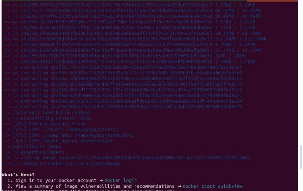
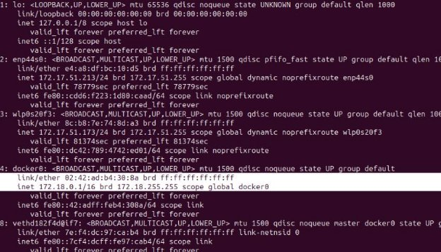
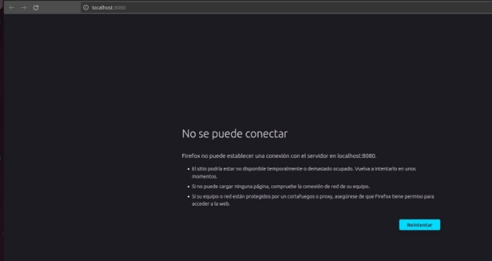

` `

#Evaluación: Construyendo una simple app con contenedor de Docker

##**Crear un Bash Script simple:**

● Crear el archivo user-input.sh en el archivo app-web.

**Ejecutar el script desde la línea de comandos.** 
```alumno@administrador-20VE:~/app-web$ ./user-input```

```
Introduzca su nombre: Vanesa Tu nombre es Vanesa.
```

**Cambiar el modo del script a un archivo ejecutable para todos los usuarios.**<BR>
```
alumno@administrador-20VE:~/app-web$ **ls -l user-input.sh** -rw-rw-r-- 1 alumno alumno 90 abr 8 11:49 user-input.sh

alumno@administrador-20VE:~/app-web$ **chmod a+x user-input.sh**

alumno@administrador-20VE:~/app-web$ **ls -l user-input.sh** -rwxrwxr-x 1 alumno alumno 90 abr 8 11:49 user-input.sh
```

**Cambiar el nombre del archivo para eliminar la extensión .sh.**

```
alumno@administrador-20VE:~/app-web$ **mv user-input.sh user-input**``` ```

alumno@administrador-20VE:~/app-web$ **./user-input** Introduzca su nombre: Vanesa

Tu nombre es Vanesa.

```

##**Crear una aplicación web simple**

Una vez que ya hayamos instalado Flask en el sistema y creado el archivo 'sample\_app.py', ejecutamos la aplicación:



Si bien hay dos maneras de comprobar si la aplicación web se está ejecutando correctamente, yo usé el método de colocar la URL en el navegador web:


##**Configurar la aplicación web para utilizar archivos de sitio web**

En esta parte, construya la aplicación web de ejemplo para incluir una página **index.html** y una especificación **style.css**. El **index.html** es normalmente la primera página cargada en el navegador web de un cliente al visitar su sitio web. El **style.css** es una hoja de estilo utilizada para personalizar el aspecto de la página web.

**Explorar los directorios que utilizará la aplicación web**

Primero, debemos crear el directorio 'templates' y, en ese directorio, crear el archivo 'index.html':<BR>

Como ya hemos creado el directorio 'templates' con 'mkdir templates', creamos el archivo 'index.html':<BR>

``` alumno@administrador-20VE:~/app-web$ **templates/index.html** ```


Ahora creamos el directorio \*\*static\*\* en lo creamos el archivo \*\*style.css\*\*. ``` alumno@administrador-20VE:~/app-web$ **cat static/style.css**```


**Actualizar el código Python para la aplicación web de muestra.** Ahora debemos actualizar el archivo \*\*sample\_app.py\*\*.


Ahora podemos copiar el[` `**http://127.0.0.1:8080**](http://0.0.0.0:8080) y pegar en web Google.


También existe otra y es utilizar el \*\*curl\*\*.


##**Crear un script de Bash para compilar y ejecutar un contenedor Docker**

Ahora tenemos que crear un archivo \*\*sample\_app.sh\*\*.

**Ejecutar el script bash.**



**Investiga el contenedor Docker en ejecución y la aplicación web.**

(a) l contenedor Docker crea su propia dirección IP a partir de un espacio de direcciones de red privada. Verificar que la aplicación web se esté ejecutando e informe de la dirección IP. En un navegador web en **http://localhost:8080**, se debería ver el mensaje **Me estás llamando desde 172.17.0.1** con formato H1 sobre un fondo azul metálico claro. También puede usar el comando **curl**, si lo desea.


De forma predeterminada, Docker utiliza la subred IPv4 172.17.0.0/16 para redes de contenedores. (Esta dirección se puede cambiar si es necesario.) Introduzca el comando **ip address** para mostrar todas las direcciones IP utilizadas . Debería ver la dirección de bucle invertido (loopback) 127.0.0.1 que usó la aplicación web anteriormente en la evaluación y la nueva interfaz Docker con la dirección IP 172.17.0.1.

Ahora necesitamos conocer la dirección \*\*ip address\*.



Para acceder al contenedor, colocamos el comando \*\*docker exec -it\*\* para entrar en modo \*\*/bin/bash\*\* (por línea de comandos) al contenedor, y para ver qué archivos contiene, usaremos el comando \*\*ls\*\*.


```
alumno@administrador-20VE:~/app-web$ docker exec -it samplerunning /bin/bash root@f498e5499151:/# ls

bin dev home lib64 mnt proc run srv tmp var

boot etc lib media opt root sbin sys usr

root@f498e5499151:/# ls home/myapp/

sample\_app.py static templates

```

**Detener y retirar el contenedor Docker.**

a)Puede detener el contenedor Docker con el comando d**ocker stop** especificando el nombre del contenedor en ejecución. Tomará unos segundos limpiar y almacenar en caché el contenedor. Puede ver que aún existe ingresando el comando **docker ps -a**. Sin embargo, si actualiza la página web para **http://localhost:8080**, verá que la aplicación web ya no se está ejecutando.

```
docker stop samplerunning samplerunning
```

```
alumno@administrador-20VE:~/app-web$ docker ps -a

CONTAINER ID IMAGE COMMAND CREATED STATUS

PORTS NAMES 782af4f4e47c kindest/node:v1.29.2 "/usr/local/bin/entr…" 2 hours ago Up 2 hours 127.0.0.1:37123->6443/tcp

demo-control-plane

776c5d921bd1 kindest/node:v1.29.2 "/usr/local/bin/entr…" 3 hours ago Up 3 hours 127.0.0.1:40497->6443/tcp

kind-control-plane

ffbb6f9a5fd9 gcr.io/k8s-minikube/kicbase:v0.0.42 "/usr/local/bin/entr…" 3 hours ago Up 3 hours 127.0.0.1:40993->22/tcp, 127.0.0.1:39733->2376/tcp, 127.0.0.1:45453->5000/tcp, 127.0.0.1:41989->8443/tcp, 127.0.0.1:36819->32443/tcp minikube

d09145546a1d hola-python "python hola.py" 6 days ago Exited (0) 6 days ago

practical\_hermann

b065c2401a7a 396d02079e43 "python hola.py" 6 days ago Exited (1) 6 days ago

```

Para eliminar permanentemente el contenedor, primero se debe detener y luego remover con el comando **docker rm**. Siempre se puede reconstruir de nuevo ejecutando el programa **sample-app**. Utiliza el comando **docker ps -a** para verificar que se ha eliminado el contenedor

```
alumno@administrador-20VE:~/app-web$ docker rm samplerunning samplerunning
```

```
alumno@administrador-20VE:~/app-web$ docker ps -a

CONTAINER ID IMAGE COMMAND CREATED STATUS PORTS NAMES
 ```


