**Evaluación: Sobre la linea de comandos**

**Navigation**

- **Comando: *pwd***

(print working directory)

Este comando muestra el directorio de trabajo actual en el que nos situamos (el cual es 'ubuntu').

**Comando: *ls***

Este comando muestra los directorios y/o archivos contenidos en el directorio actual en el que nos situamos.

- **Comando: *cd***

Este comando nos permite cambiar o movernos entre los distintos directorios existentes.

- Acceso Absoluta

- Acceso relativa

**Looking Around**

- **Comando: *ls***

Este comando lista los directorios y/o archivos existentes.

**ls: Solo muestra los archivos y/o directorios del directorio de trabajo actual.**

**ls /bin: Muestra los archivos y/o directorios del directorio /bin.**

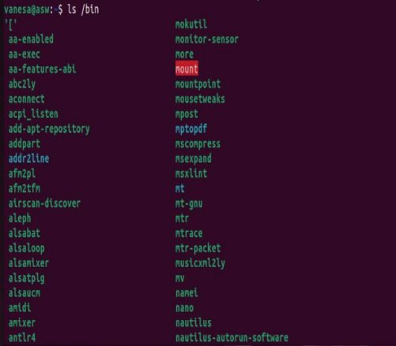

**ls -l: Muestra los archivos y/o directorios del directorio actual en formato 'long'.**

**ls -l /etc /bin: Muestra los archivos y/o directorios de los directorios /bin y /etc en formato 'long'.**

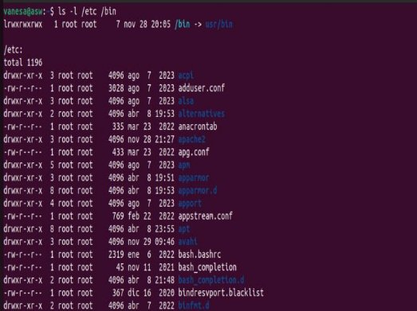

**ls -la: Muestra los archivos y/o directorios (incluyendo los ocultos) en formato 'long'.**

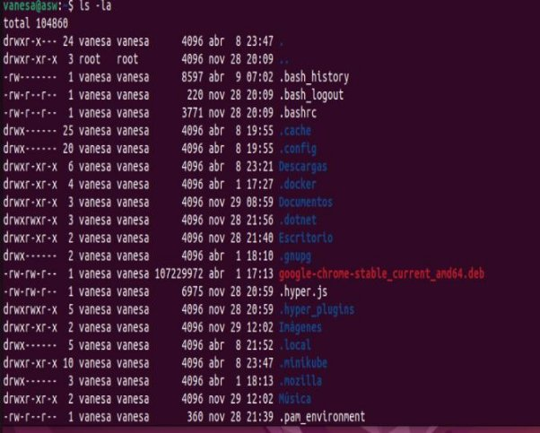**ls -l -a: Muestra los archivos y/o directorios (incluyendo los ocultos por el -a) en formato 'long' (es igual a 'ls -la').**

- **CONSIDERACIÓN - COMANDO: 'ls -la ..' o 'ls -l -a ..'**

Los dos puntos '..' hacen referencia al directorio que contiene al directorio 'vanesa', es decir, 'home'. En otras palabras, se obtienen los archivos y/o directorios ocultos y no ocultos del directorio 'home'. 'home' en este caso, puesto que dependerá del directorio actual en donde se encuentre el usuario.

- **Comando: *less***

Este comando permite visualizar archivos de texto mediante un visualizador de archivos de texto.

- **Comando: *file***

Este comando permite indicar el tipo y/o formato de un archivo

**A Guided Tour**

- **Directorio root: '/'**

El directorio raíz donde comienza el sistema de archivos. El directorio raíz probablemente contendrá sólo subdirectorios.

- **Directorio boot: '/boot':**

Aquí es donde se guardan los archivos del kernel de Linux y del cargador de arranque. El núcleo es un archivo llamado vmlinuz.

- **Directorio etc: '/etc/ :**

El /etc directorio contiene los archivos de configuración del sistema. Todos los archivos /etc deben ser archivos de texto.

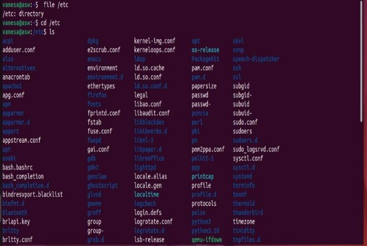

- **‘bin' y 'usr/bin': '/bin' '/usr/bin':**

Estos dos directorios contienen la mayoría de los programas del sistema. El /bin directorio contiene los programas esenciales que el sistema requiere para funcionar, al mismo tiempo que /usr/bin contiene aplicaciones para los usuarios del sistema.

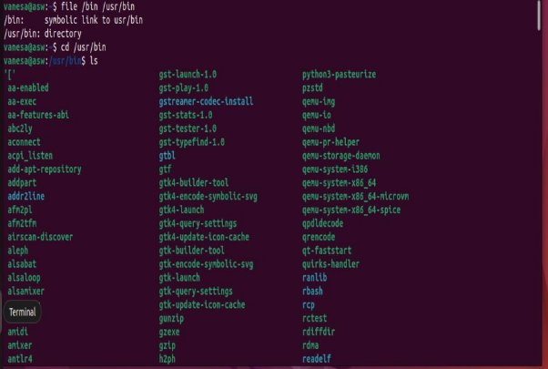

- **'sbin' y 'usr/sbin': '/sbin' '/usr/sbin':**

Los sbindirectorios contienen programas para la administración del sistema, principalmente para uso del superusuario.

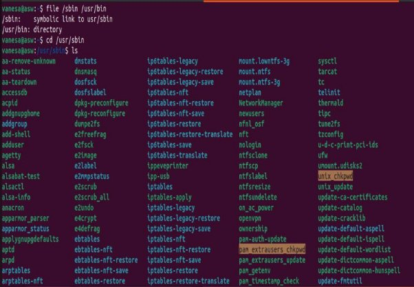

- **Directorio usr: '/usr':**

El /usrdirectorio contiene una variedad de elementos que respaldan las aplicaciones de usuario.

- **Directorio user/local: '/usr/local':**

/usr/localy sus subdirectorios se utilizan para la instalación de software y otros archivos para su uso en la máquina local.

- **Directorio var: '/var':**

El /vardirectorio contiene archivos que cambian a medida que se ejecuta el sistema.

- **lib: '/lib':**

Las bibliotecas compartidas (similares a las DLLen ese otro sistema operativo) se guardan aquí.

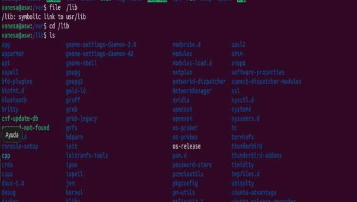

- **Directorio home: '/home':**

/homees donde los usuarios guardan su trabajo personal. En general, este es el único lugar donde los usuarios pueden escribir archivos. Esto mantiene las cosas bonitas y limpias :-)

- **Directorio root: '/root':**

Este es el directorio de inicio del superusuario.

- **Directorio tmp: '/tmp':**

/tmpes un directorio en el que los programas pueden escribir sus archivos temporales.

- **Directorio dev: '/dev':**

El /devdirectorio es un directorio especial, ya que en realidad no contiene archivos en el sentido habitual.

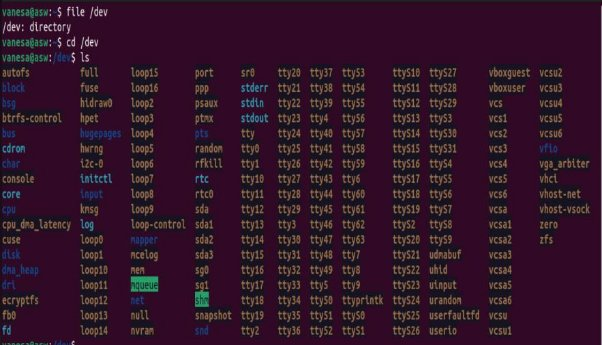

- **Directorio proc: '/proc':**

El /procdirectorio también es especial. Este directorio no contiene archivos. De hecho, este directorio realmente no existe en absoluto.

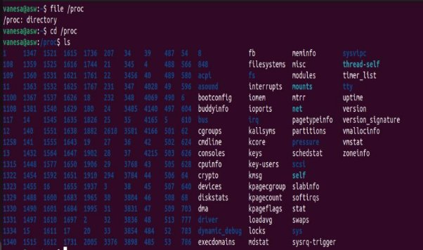

**Directorio media: '/media':**

Finalmente llegamos a la /media, un directorio normal que se utiliza de forma especial. El directorio se utiliza para puntos de montaje.

Manipulating Files

Esta lección presentará los siguientes comandos:

- [**cp**](https://linuxcommand.org/lc3_man_pages/cp1.html)- copiar archivos y directorios
- [**mv**](https://linuxcommand.org/lc3_man_pages/mv1.html)- mover o cambiar el nombre de archivos y directorios
- [**rm**](https://linuxcommand.org/lc3_man_pages/rm1.html)- eliminar archivos y directorios
- [**~~mkdir~~**](https://linuxcommand.org/lc3_man_pages/mkdir1.html)- crea directorios

**Comando: *cp***

Este comando permitirá copiar archivos y/o directorios.

1) ***cp file1 file2***

Este comando permite copiar los contenidos de los archivos. Sin embargo, hay dos posibilidades: Si 'file2' no existe, entonces al colocar el comando, dicho archivo se creará automáticamente con el contenido de 'file1' Por otra parte, si 'file2' existe, el contenido de 'file1' se copiará en 'file2':

2) ***cp -i file1 file2***

En este comando, a diferencia del anterior, el '-i' indica que si el archivo existe, 'se preguntará' al usuario si desea sobreescribir el contenido:

3) ***cp file1 dir1***

Este comando copia un archivo 'file1' al directorio especificado 'dir1':

4) ***cp -R dir1 dir2***

Este comando permite copiar el contenido de 'dir1' a 'dir2'. Si 'dir2' no existiera, este se creará automáticamente al ejecutar el comando:

**Comando: *mv***

El **mv**comando mueve o cambia el nombre de archivos y directorios según cómo se utilice. Moverá uno o más archivos a un directorio diferente o cambiará el nombre de un archivo o directorio. Para cambiar el nombre de

un archivo, se usa así:

1)mv filename2 filename1: Si archivo2 no existe, entonces se cambia el nombre de archivo1 a archivo2 . Si filename1 existe, su contenido se reemplaza silenciosamente con el contenido de filename2 ***.***

2) ***Sin embargo, como arriba, dado que se especifica la opción "-i" (interactiva), si el archivo2 existe, se le pregunta al usuario antes de sobrescribirlo con el contenido del archivo1***
2) *file1 file2 dir1*

   *4) mv dir1 dir2*

   Si *dir2* no existe, entonces *dir1* pasa a llamarse *dir2* . Si *dir2* existe, el directorio *dir1* se mueve dentro del directorio *dir2*

**Comando: *rm***

Este comando sirve para borrar archivos y/o directorios:

1) ***rm file1 file2***

Este comando borra los archivos 'file1' y 'file2':

2) ***rm -i file1 file2***

Al colocar el '-i' (interactive), se preguntará al usuario si desea borrar dichos archivos:

3) ***rm -r dir1 dir2***

Este comando borra los directorios (necesariamente debe ir '-r' para especificar que son directorios lo que se va a borrar) 'dir1' y 'dir2':

**\*También se le puede añadir '-i' para que el sistema pregunte si se van a borrar aquellos directorios: rm -r -i dir1 ...**

**Comando: *mkdir***

Este comando crea directorios

***1) mkdir dir ...* (los '...' hacen referencia a que se pueden crear muchos directorios en una sola línea de código)**

1\. mkdir directorio

**Working with Commands**

Hasta ahora hemos visto una serie de comandos y sus misteriosas opciones y argumentos. En esta lección, intentaremos eliminar algo de ese misterio. Introduciremos los siguientes comandos.

- [**type**](https://linuxcommand.org/lc3_man_pages/typeh.html)- Mostrar información sobre el tipo de comando
- [**~~which~~**](https://linuxcommand.org/lc3_man_pages/which1.html)- Localizar un comando
- [**help**](https://linuxcommand.org/lc3_man_pages/helph.html)- Mostrar página de referencia para el shell incorporado
- [**man**](https://linuxcommand.org/lc3_man_pages/man1.html)- Mostrar una referencia de comando en línea
- COMANDO TYPE:

  El **type** comando es un shell incorporado que muestra el tipo de comando que ejecutará el shell, dado un nombre de comando particular. Funciona así:

  

Aquí vemos los resultados de tres comandos diferentes. Observe que el de **ls**y cómo el comando ls es en realidad un alias para el **ls**comando con la opción “-- color=auto” agregada. ¡Ahora sabemos por qué la salida **ls**se muestra en color!

**which:**

Solo funciona para programas ejecutables, no para incorporados ni alias que sustituyan a los programas ejecutables reales.

**help:**

bash tiene una función de ayuda incorporada disponible para cada una de las funciones integradas del shell. Para usarlo, escriba "ayuda" seguido del nombre del shell integrado.

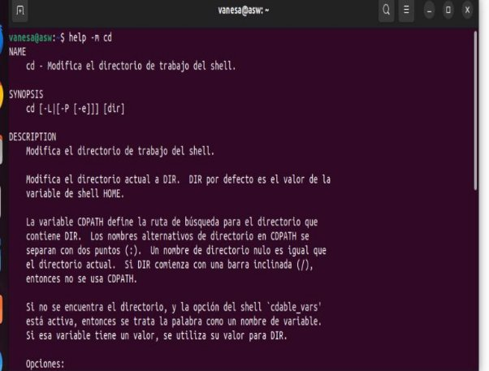

**-- help:**

Muchos programas ejecutables admiten una opción “--help” que muestra una descripción de la sintaxis y las opciones admitidas del comando.

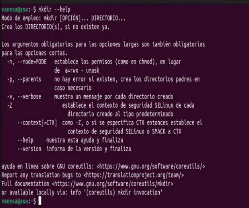

**man:**

En la mayoría de los sistemas Linux, manse utiliza lesspara mostrar la página del manual, por lo que todos los lesscomandos familiares funcionan mientras se muestra la página

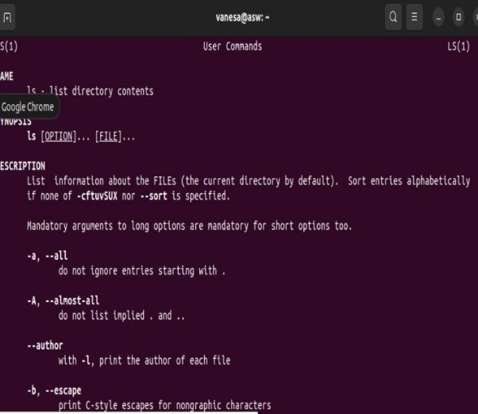
