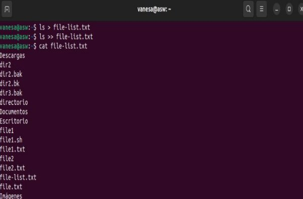
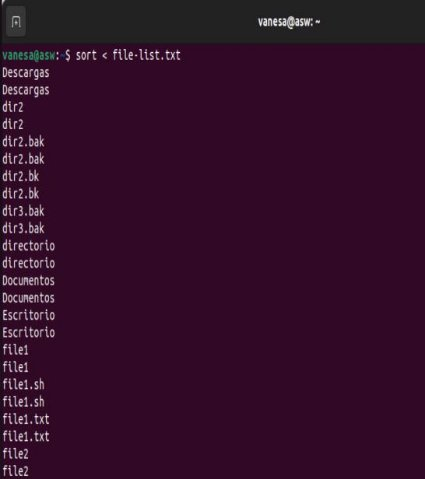
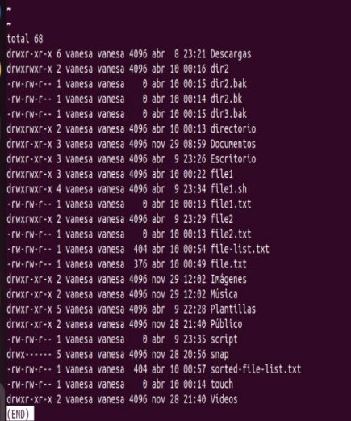
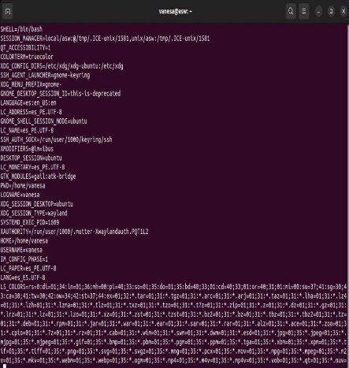
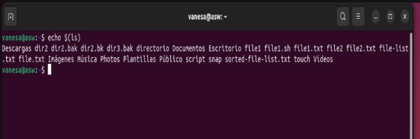
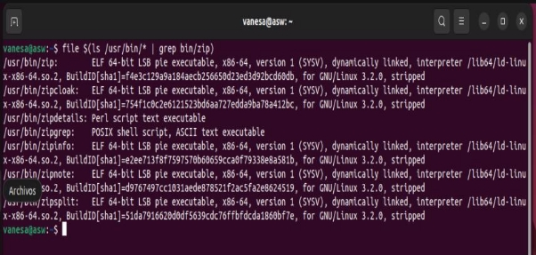
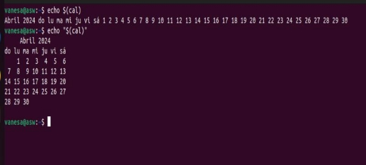
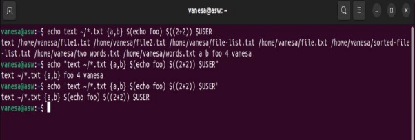

**Evaluación: Sobre la linea de comandos**

I/O Redirection

**Standard Output ‘>’ :**

La mayoría de los programas de línea de comando que muestran sus resultados lo hacen enviándolos a una instalación llamada *salida estándar*

. De forma predeterminada, la salida estándar dirige su contenido a la pantalla. Para redirigir la salida estándar a un archivo, el carácter ">" se utiliza así:

**Standard Input ‘<’:**

Muchos comandos pueden aceptar entradas de una función llamada entrada estándar . De forma predeterminada, la entrada estándar obtiene su contenido del teclado, pero al igual que la salida estándar, se puede redirigir. Para redirigir la entrada estándar desde un archivo en lugar del teclado, el carácter "<" se usa así:

En el ejemplo anterior, utilizamos el [sort](https://linuxcommand.org/lc3_man_pages/sort1.html)comando para procesar el contenido de file\_list.txt. Los resultados se muestran en la pantalla ya que la salida estándar no fue redirigida. Podríamos redirigir la salida estándar a otro archivo como este:

**Pipelines:**

Lo más útil y poderoso que podemos hacer con la redirección de E/S es conectar múltiples comandos para formar lo que se llaman canalizaciones . Con las canalizaciones, la salida estándar de un comando se introduce en la entrada estándar de otro.

- ls -lt | [head](https://linuxcommand.org/lc3_man_pages/head1.html):

Muestra los 10 archivos más nuevos en el directorio actual.

- [**du](https://linuxcommand.org/lc3_man_pages/du1.html) **| sort -nr:**

  Muestra una lista de directorios y cuánto espacio consumen, ordenados de mayor a menor.

- [**find](https://linuxcommand.org/lc3_man_pages/find1.html) **. -type f -print | [wc](https://linuxcommand.org/lc3_man_pages/wc1.html) -l:**

Muestra el número total de archivos en el directorio de trabajo actual y todos sus subdirectorios.

FILTERS

- SORT:

Ordena la entrada estándar y luego genera el resultado ordenado en la salida estándar.

- UNIQ:

Dado un flujo ordenado de datos de entrada estándar, elimina líneas de datos duplicadas (es decir, se asegura de que cada línea sea única).

- GREP:

Examina cada línea de datos que recibe de la entrada estándar y genera cada línea que contiene un patrón de caracteres específico.

- FMT:

Lee texto de la entrada estándar y luego genera texto formateado en la salida estándar.

- HEAD:

Genera las primeras líneas de su entrada. Útil para obtener el encabezado de un archivo.

- TAIL:

Muestra las últimas líneas de su entrada. Útil para cosas como obtener las entradas más recientes de un archivo de registro.

- TR:

Traduce caracteres. Se puede utilizar para realizar tareas como conversiones de mayúsculas/minúsculas o cambiar caracteres de terminación de línea de un tipo a otro (por ejemplo, convertir archivos de texto de DOS en archivos de texto de estilo Unix).

- AWK:

Un lenguaje de programación completo diseñado para construir filtros. Extremadamente poderoso

**Expansion**

Para demostrar lo que queremos decir con esto, echemos un vistazo al [echo](https://linuxcommand.org/lc3_man_pages/echoh.html)comando. echoes un shell integrado que realiza una tarea muy simple. Imprime sus argumentos de texto en la salida estándar:

1) echo this is a test

2) echo \*

Eso es bastante sencillo. Cualquier argumento pasado a echose muestra. Probemos con otro ejemplo:

**Pathname Expansion**

El mecanismo por el cual funcionan los comodines se llama *expansión de nombre de ruta* . Si probamos algunas de las técnicas que empleamos en nuestras lecciones anteriores, veremos que en realidad son expansiones. Dado un directorio de inicio que se parece a este:

1 ) ls

2) echo D\*

3) echo \*s

4)echo [[:upper:]]\*

5)echo /usr/\*/share

**Tilde Expansion**

Como recordamos de nuestra introducción al **cd** comando, el carácter de tilde (“~”) tiene un significado especial. Cuando se usa al principio de una palabra, se expande al nombre del directorio de inicio del usuario designado o, si no se nombra ningún usuario, al directorio de inicio del usuario actual:

1)echo ~

Si el usuario "foo" tiene una cuenta, entonces:

\2) echo ~foo

Arithmetic Expansion

El shell permite realizar aritmética mediante expansión. Esto nos permite usar el símbolo del shell como calculadora: “$((expresión))”

1)echo$((2+2))

2)echo $(((5\*\*2) \* 3))

A continuación se muestra un ejemplo que utiliza los operadores de división y resto. Observe el efecto de la división de números enteros:

3)echo Five divided by two equals $((5/2)) echo with $((5%2)) left over.

Brace Expansion

Quizás la expansión más extraña se llama *expansión de llaves* . Con él, podemos crear múltiples cadenas de texto a partir de un patrón que contenga llaves. He aquí un ejemplo:

1)echo Front-{A,B,C}-Back

Los patrones que se van a expandir entre llaves pueden contener una parte inicial llamada *preámbulo* y una parte final llamada *posdata* .

2)echo Number\_{1..5}

3)echo {Z..A}

4)echo a{A{1,2},B{3,4}}b

5)mkdir Photos

**Parameter Expansion**

Muchos de estos fragmentos, más propiamente llamados variables , están disponibles para nuestro examen. Por ejemplo, la variable denominada "USUARIO" contiene nuestro nombre de usuario. Para invocar la expansión de parámetros y revelar el contenido de USUARIO haríamos esto:

1)echo $USER

2)printenv | less

3)echo $SUER

**Command Substitution**

La sustitución de comandos nos permite utilizar la salida de un comando como una expansión:

1)echo $(ls)

2)ls -l $(which cp)

3)file $(ls /usr/bin/\* | grep bin/zip)

4)ls -l `which cp`

**Quoting**

Ahora que hemos visto de cuántas maneras el shell puede realizar expansiones, es hora de aprender cómo podemos controlarlo. Toma por ejemplo:

1)echo this is a test cho The total is $100.00

Double Quotes

El primer tipo de cita que veremos son las comillas dobles. Si colocamos texto entre comillas dobles, todos los caracteres especiales utilizados por el shell pierden su significado especial y se tratan como caracteres comunes. Las excepciones son “$”, “\” (barra invertida) y “`” (comillas invertidas).

1)ls -l two words.txt

2)echo "$USER $((2+2)) $(cal)"

5)echo this is a test

6)echo "this is a test"

7)echo $(cal)

**Single Quotes**

Cuando necesitamos suprimir todas las expansiones, utilizamos comillas simples. Aquí hay una comparación de comillas simples, dobles y sin comillas:

1)echo text ~/\*.txt {a,b} $(echo foo) $((2+2)) $USER 2)echo "text ~/\*.txt {a,b} $(echo foo) $((2+2)) $USER" 3)echo 'text ~/\*.txt {a,b} $(echo foo) $((2+2)) $USER'

**Escaping Characters**

A veces sólo queremos citar un solo carácter. Para ello podemos anteponer un carácter con una barra invertida, que en este contexto se llama carácter de escape . A menudo esto se hace entre comillas dobles para evitar selectivamente una expansión:

1)echo "The balance for user $USER is: \$5.00"

**More Backslash Tricks**

1)echo -e "Inserting several blank lines\n\n\n" 2)echo -e "Words\tseparated\tby\thorizontal\ttabs.” 3)echo -e "\aMy computer went \"beep\"."

\4)

5)echo -e "DEL C:\\WIN2K\\LEGACY\_OS.EXE"

Permissions

Esta lección cubrirá los siguientes comandos:

- [**chmod**](https://linuxcommand.org/lc3_man_pages/chmod1.html)- modificar los derechos de acceso a archivos
- [**su**](https://linuxcommand.org/lc3_man_pages/su1.html)- convertirse temporalmente en superusuario
- [**~~sudo~~**](https://linuxcommand.org/lc3_man_pages/sudo8.html)- convertirse temporalmente en superusuario
- [**chown**](https://linuxcommand.org/lc3_man_pages/chown1.html)- cambiar la propiedad del archivo
- [**chgrp**](https://linuxcommand.org/lc3_man_pages/chgrp1.html)- cambiar la propiedad del grupo de un archivo

Permisos de archivos

\1) ls -l /bin/bash

Aquí podemos ver:

- El archivo "/bin/bash" es propiedad del usuario "root"
- El superusuario tiene derecho a leer, escribir y ejecutar este archivo.
- El archivo es propiedad del grupo "root"
- Los miembros del grupo "root" también pueden leer y ejecutar este archivo.

COMANDO CHMOD

- El **chmod**comando se utiliza para cambiar los permisos de un archivo

  o directorio. Para usarlo especificamos la configuración de permisos deseada y el archivo o archivos que deseamos modificar. Hay dos formas de especificar los permisos. En esta lección nos centraremos en uno de ellos, llamado método *de notación octal* Todos los demás pueden leer y ejecutar este archivo.

Convertirse en superusuario por un corto tiempo

A menudo es necesario convertirse en superusuario para realizar importantes tareas de administración del sistema, pero como sabemos, no debemos permanecer conectados como superusuario.

COMANDO SU

Cambiar la propiedad del archivo:

Podemos cambiar el propietario de un archivo usando el **chown**comando. He aquí un ejemplo: supongamos que queremos cambiar el propietario some\_filede "yo" a "tú". Pudimos:

Cambiar la propiedad del grupo:

La propiedad del grupo de un archivo o directorio se puede cambiar con **chgrp**. Este comando se usa así:

Job Control

- [**~~ps~~**](https://linuxcommand.org/lc3_man_pages/ps1.html)- enumerar los procesos que se ejecutan en el sistema
- [**kill**](https://linuxcommand.org/lc3_man_pages/killh.html)- enviar una señal a uno o más procesos (normalmente para "matar" un proceso)
- [**~~jobs~~**](https://linuxcommand.org/lc3_man_pages/jobsh.html)- una forma alternativa de enumerar sus propios procesos
- [**bg**](https://linuxcommand.org/lc3_man_pages/bgh.html)- poner un proceso en segundo plano
- [**fg**](https://linuxcommand.org/lc3_man_pages/fgh.html)- poner un proceso en primer plano

**Un ejemplo práctico**

**Poner un programa en segundo plano:**

Ahora, para hacernos la vida un poco más fácil, vamos a iniciar **xload**nuevamente el programa, pero esta vez lo pondremos en segundo plano para que vuelva a aparecer el mensaje. Para ello ejecutamos xload así:

**Listado de procesos en ejecución:**

Ahora que tenemos un proceso en segundo plano, sería útil mostrar una lista de los procesos que hemos iniciado. Para hacer esto, podemos usar el **jobs**comando o el comando más poderoso **ps**.

Matar un proceso

Supongamos que tenemos un programa que deja de responder; ¿Cómo nos deshacemos de él? Usamos el **kill**comando, por supuesto. Probemos esto en **xload**. Primero, necesitamos identificar el proceso que queremos eliminar. Podemos usar **jobs**o **ps**, para hacer esto. Si lo utilizamos, **jobs**obtendremos un número de trabajo. Con **ps**, se nos proporciona una *identificación de proceso* (PID). Lo haremos de ambas maneras:

**Un poco más sobre matar:**

Si bien el **kill**comando se utiliza para "matar" procesos, su verdadero propósito es enviar *señales* a los procesos.

1. Utilice el **ps**comando para obtener la identificación del proceso (PID) del proceso que queremos finalizar.
1. Emita un **kill**comando para ese PID.
1. Si el proceso se niega a terminar (es decir, ignora la señal), envíe señales cada vez más duras hasta que termine.

