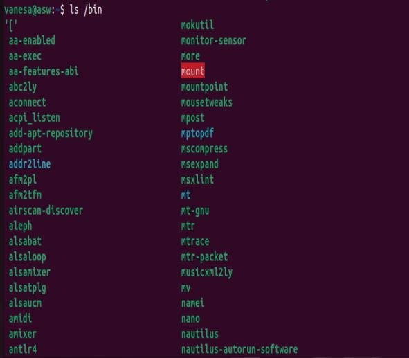
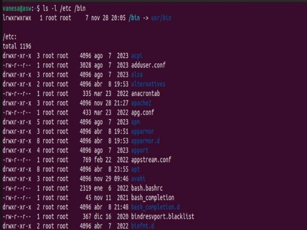
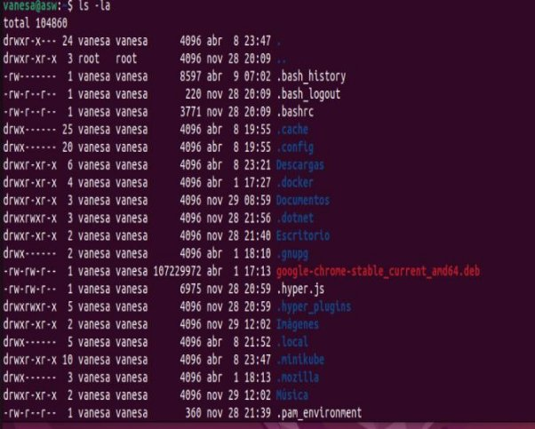
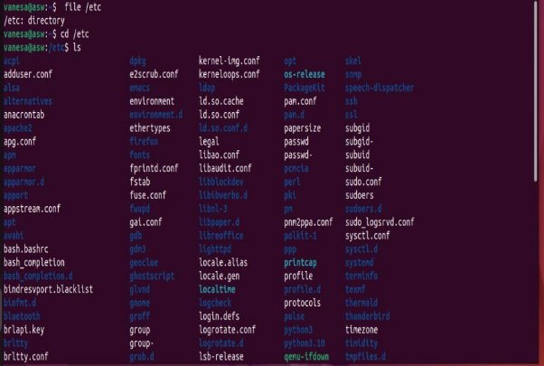
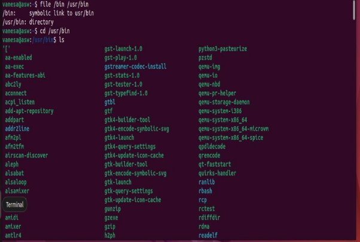
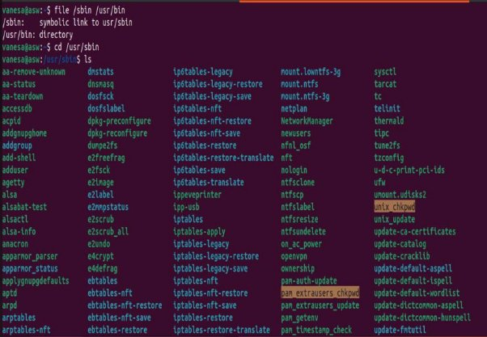
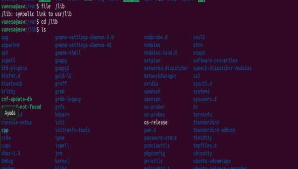
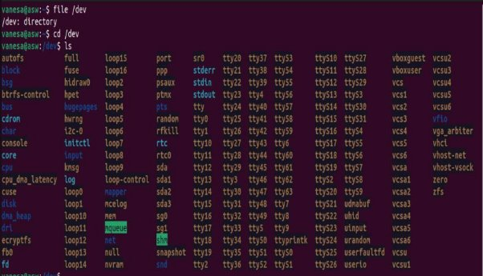
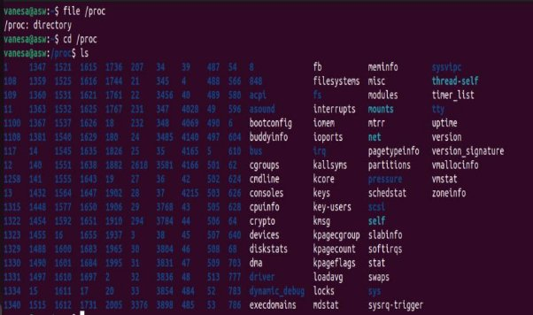



**Evaluación: Sobre la linea de comandos**

**Objetivos**

Linux, siendo un sistema operativo tipo Unix, es ampliamente utilizado en servidores, supercomputadoras y sistemas distribuidos. Conocer la línea de comandos de Linux permite comprender y manipular el sistema operativo subyacente en el que se ejecutan sus aplicaciones concurrentes y distribuidas, ofreciendo una comprensión profunda de su entorno de ejecución.

La línea de comandos de Linux es una herramienta poderosa para la automatización de tareas repetitivas y la gestión eficiente de recursos del sistema. Podemos aprender a escribir scripts para automatizar la compilación y ejecución de sus programas, la gestión de procesos, el monitoreo del uso de recursos y la implementación de sistemas. Esta habilidad es invaluable en entornos de computación distribuida, donde la gestión manual de múltiples nodos y servicios puede ser tediosa y propensa a errores.

Muchas herramientas esenciales para el desarrollo, la prueba y la depuración de software en computación concurrente y distribuida son accesibles a través de la línea de comandos. Esto incluye herramientas para control de versiones (como **git**), empaquetado y despliegue de software (como **make** y **docker**), y monitoreo de rendimiento y recursos (como **top**, **vmstat**, y **netstat**) . Familiarizarse con estas herramientas es esencial para el desarrollo de software eficiente.

El conocimiento de la línea de comandos es fundamental para interactuar con servicios en la nube y sistemas distribuidos, muchos de los cuales ofrecen interfaces basadas en CLI (Command Line Interface) para su gestión y configuración. Aprenderemos a desplegar, configurar y monitorear aplicaciones distribuidas en entornos cloud, utilizando la línea de comandos.

La línea de comandos promueve un entendimiento más profundo de cómo funcionan los computadores y las redes, alentando a todos a pensar y resolver problemas de manera algorítmica. Esta forma de pensamiento es transferible a muchos otros ámbitos de la informática y la ingeniería de software.

**Instrucciones de Entrega:**

- Realiza todos los pasos de cada sección en la terminal, capturando capturas de pantalla
  - copiando el texto de la terminal que demuestre la ejecución de la sección Learning the Shell de la página: <https://linuxcommand.org/lc3_learning_the_shell.php>
- Crea un documento en markdown que incluya una breve explicación de cada tarea, junto con las capturas de pantalla o texto correspondiente.
- Subir el documento final a tu repositorio personal hasta el día 13 de abril (23:59).

**Navigation**

**Comandos: pwd, cd, ls**

**Comando: *pwd* (print working directory)**

Este comando muestra el directorio de trabajo actual en el que nos situamos (el cual es 'ubuntu').

**Comando: *ls***

Este comando muestra los directorios y/o archivos contenidos en el directorio actual en el que nos situamos.

**Comando: *cd***

Este comando nos permite cambiar o movernos entre los distintos directorios existentes.

- Acceso Absoluta

- Acceso relativa

**Looking Around**

**Comandos: ls, less, file Comando: *ls***

Este comando lista los directorios y/o archivos existentes.

**ls: Solo muestra los archivos y/o directorios del directorio de trabajo actual.**

**ls /bin: Muestra los archivos y/o directorios del directorio /bin.**

**ls -l: Muestra los archivos y/o directorios del directorio actual en formato 'long'.**

**ls -l /etc /bin: Muestra los archivos y/o directorios de los directorios /bin y /etc en formato 'long'.**

**ls -la: Muestra los archivos y/o directorios (incluyendo los ocultos) en formato 'long'.**

**ls -l -a: Muestra los archivos y/o directorios (incluyendo los ocultos por el -a) en formato 'long' (es igual a 'ls -la').**

- **CONSIDERACIÓN - COMANDO: 'ls -la ..' o 'ls -l -a ..'**

Los dos puntos '..' hacen referencia al directorio que contiene al directorio 'vanesa', es decir, 'home'. En otras palabras, se obtienen los archivos y/o directorios ocultos y no ocultos del directorio 'home'. 'home' en este caso, puesto que dependerá del directorio actual en donde se encuentre el usuario.

**Comando: *less***

Este comando permite visualizar archivos de texto mediante un visualizador de archivos de texto.

**Comando: *file***

Este comando permite indicar el tipo y/o formato de un archivo

**A Guided Tour**

**Directorio root: '/'**

**Directorio boot: '/boot'**

**Directorio etc: '/etc/**

**‘bin' y 'usr/bin': '/bin' '/usr/bin'**

**'sbin' y 'usr/sbin': '/sbin' '/usr/sbin'**

**Directorio usr: '/usr'**

**Directorio user/local: '/usr/local'**

**Directorio var: '/var'**

**lib: '/lib'**

**Directorio home: '/home'**

**Directorio root: '/root'**

**Directorio tmp: '/tmp'**

**Directorio dev: '/dev'**

**Directorio proc: '/proc'**

**Directorio media: '/media'**

Manipulating Files

Esta lección presentará los siguientes comandos:

- [**cp**](https://linuxcommand.org/lc3_man_pages/cp1.html)- copiar archivos y directorios
- [**mv**](https://linuxcommand.org/lc3_man_pages/mv1.html)- mover o cambiar el nombre de archivos y directorios
- [**~~rm~~**](https://linuxcommand.org/lc3_man_pages/rm1.html)- eliminar archivos y directorios
- [**mkdir**](https://linuxcommand.org/lc3_man_pages/mkdir1.html)- crea directorios
