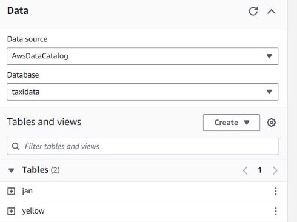
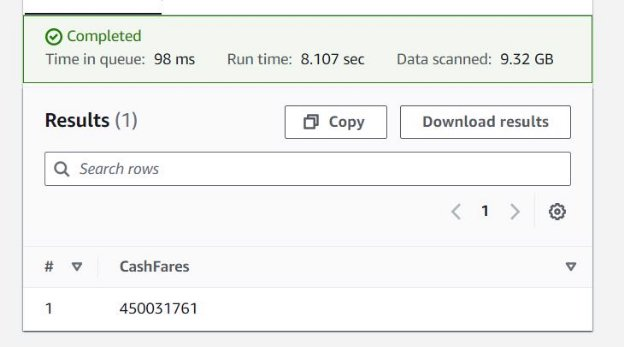
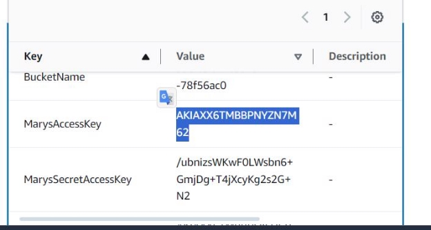

Lab: Querying Data by Using Athena

Tarea 1: Creación y consulta de una base de datos y una tabla de AWS Glue en Athena

La primera tarea es usar sentencias SQL para definir un esquema para una tabla que pueda usarse para trabajar con los datos CSV de muestra.

En esta tarea, harás lo siguiente:

Especificar un bucket de S3 para los resultados de las consultas.

Crear una base de datos de AWS Glue usando el editor de consultas de Athena.

Crear una tabla en la base de datos de AWS Glue e importar datos.

Previsualizar los datos en la tabla de AWS Glue.

En Query1, ejecutaremos el siguiente comando SQL:

CREATE DATABASE taxidata;

La data se puede visualizar de la siguiente manera.

En la consola de Athena, en la sección **Tables and views** a la izquierda, elige **Create** > **S3 bucket data**, y configura lo siguiente:

- **Nombre de la tabla:** Ingresa yellow
- **Descripción:** Ingresa Tabla para datos de taxis
- **Configuración de la base de datos:** Selecciona **Choose an existing database**, y luego elige **taxidata** de la lista desplegable.
- **Ubicación del conjunto de datos de entrada:** Copia el siguiente enlace en el campo:

s3://aws-tc-largeobjects/CUR-TF-200-ACDSCI-1/Lab2/yellow/ Después el siguiente texto:

Esta data se visualiza en la tabla.

Ahora se consultará en SQL:

Tarea 2: Optimización de las consultas Athena mediante el uso de buckets

En esta tarea, experimentarás con la creación de buckets de datos para optimizar las consultas de Athena. Completarás las siguientes acciones:

Crear una tabla llamada jan para contener datos en buckets.

Comparar cuánto tiempo toma ejecutar una consulta en los datos en buckets de enero de 2017 y cuánto tiempo toma consultar el conjunto de datos completo para los datos de enero de 2017. Crear una tabla para los datos de enero de 2017.

En el editor de consultas de Athena, elige la pestaña Editor.

Para abrir una nueva pestaña de consulta, elige el icono más a la derecha de la sección de consultas.

Copia y pega el siguiente texto en la nueva pestaña de consulta, y luego elige Ejecutar:

CREATE EXTERNAL TABLE IF NOT EXISTS jan (![ref1]

`vendor` string,

`pickup` timestamp,

`dropoff` timestamp,

`count` int,

`distance` int,

`ratecode` string,

`storeflag` string,

`pulocid` string,

`dolocid` string,

`paytype` string,

`fare` decimal,

`extra` decimal,

`mta\_tax` decimal,

`tip` decimal,

`tolls` decimal,

`surcharge` decimal,

`total` decimal

)

ROW FORMAT SERDE 'org.apache.hadoop.hive.serde2.lazy.LazySimpleSerDe' WITH SERDEPROPERTIES (

'serialization.format' = ',',

'field.delim' = ','

) LOCATION 's3://aws-tc-largeobjects/CUR-TF-200-ACDSCI-1/Lab2/January2017/'

TBLPROPERTIES ('has\_encrypted\_data'='false');

Esta data creada se visualiza en Tables.

Ejecuta la siguiente consulta en la tabla yellow, que tiene datos para todo el año. Los datos no se dividen en buckets mensuales.

SELECT count (count) AS "Number of trips" ,![ref1]

sum (total) AS "Total fares" ,

pickup AS "Trip date"

FROM yellow WHERE pickup

between TIMESTAMP '2017-01-01 00:00:00'

and TIMESTAMP '2017-02-01 00:00:01' GROUP BY pickup;

El mensaje Query successful se muestra. Anota el tiempo de ejecución y la cantidad de datos escaneados para la consulta.

Ahora, compararás ejecutando una consulta en la tabla jan.

Ejecuta la siguiente consulta en la tabla jan.

SELECT count (count) AS "Number of trips" ,![ref1]

sum (total) AS "Total fares" ,

pickup AS "Trip date"

FROM jan

GROUP BY pickup;

Tarea 3: Optimización de las consultas Athena mediante particiones Ejecuta la siguiente consulta en una nueva pestaña de consulta: CREATE TABLE taxidata.creditcard

WITH (

format = 'PARQUET'

)AS

SELECT \* from "yellow"

WHERE paytype = '1';

Ahora, compararás el rendimiento de ejecutar consultas en los datos no particionados en la tabla yellow y los datos particionados en la tabla creditcard.

Para consultar los datos no particionados en la tabla yellow, ejecuta la siguiente consulta en una nueva pestaña de consulta:

SELECT sum (total), paytype FROM yellow![ref2]

WHERE paytype = '1' GROUP BY paytype;

Para consultar los datos particionados en la tabla creditcard, ejecuta la siguiente consulta en una nueva pestaña de consulta:

SELECT sum (total), paytype FROM creditcard![ref2]

WHERE paytype = '1' GROUP BY paytype;

Se visualiza el credicard en la tabla. .

Tarea 4: Utilización de las vistas de Athena

Crear una vista para calcular el valor total en dólares de las tarifas de taxi que se pagaron con tarjeta de crédito.

Crear una vista para calcular el valor total en dólares de las tarifas que se pagaron en efectivo. Recuperar todos los registros de cada una de estas vistas.

Crear una nueva vista que una los datos de estas dos vistas.

Previsualizar los resultados de la unión.

Para crear una vista para el valor total en dólares de las tarifas que se pagaron con tarjeta de crédito, ejecuta la siguiente consulta:

CREATE VIEW cctrips AS![ref2]

SELECT "sum"("fare") "CreditCardFares"

FROM yellow

WHERE ("paytype"='1');

Para crear una vista para el valor total en dólares de las tarifas que se pagaron en efectivo, ejecuta la siguiente consulta:

CREATE VIEW cashtrips AS![ref1]

SELECT "sum"("fare") "CashFares"

FROM yellow

WHERE ("paytype"='2');

Para seleccionar todos los registros de la vista cctrips, ejecuta la siguiente consulta: Select \* from cctrips;

Para seleccionar todos los registros de la vista cashtrips, ejecuta la siguiente consulta:

Select \* from cashtrips;

Ahora aprenderás a crear una vista que una los datos de dos vistas diferentes. Usarás esta nueva vista para conocer los ingresos totales de los pagos con tarjeta de crédito en comparación con los pagos en efectivo para dos proveedores.

Para crear una nueva vista que una los datos, ejecuta la siguiente consulta:

CREATE VIEW comparepay AS WITH![ref1]

cc AS

(SELECT sum(fare) AS cctotal,

vendor

FROM yellow

WHERE paytype = '1'

GROUP BY paytype, vendor),

cs AS

(SELECT sum(fare) AS cashtotal,

vendor, paytype

FROM yellow

WHERE paytype = '2'

GROUP BY paytype, vendor)

SELECT cc.cctotal, cs.cashtotal FROM cc

JOIN cs

ON cc.vendor = cs.vendor;

Tarea 5: Creación de consultas con nombre Athena mediante CloudFormation

El equipo de ciencia de datos quiere compartir las consultas que construyeron usando el conjunto de datos de taxis. El equipo quisiera compartirlas con otros departamentos, pero esos departamentos usan otras cuentas en AWS. Otros departamentos tienen menos experiencia con AWS, por lo que el equipo de ciencia de datos quisiera simplificar el proceso para que otros departamentos usen Athena.

Nota: En este laboratorio, te enfocarás en crear una plantilla de CloudFormation para crear una consulta con nombre en Athena. La plantilla no creará la base de datos de AWS Glue ni las tablas y datos dentro de ella.

Quieres simplificar el proceso para implementar consultas. Después de alguna investigación, determinas que la mejor solución es construir una plantilla de CloudFormation para cada consulta. La plantilla se puede compartir con otros departamentos e implementar según sea necesario.

Primero, quieres experimentar construyendo una consulta de ejemplo y probándola usando el usuario IAM de Mary. Si tienes éxito, compartirás la plantilla con otros departamentos.

Revisa y ejecuta la consulta de ejemplo.

Mary te proporciona la siguiente consulta de ejemplo:

SELECT distance, paytype, fare, tip, tolls, surcharge, total FROM yellow WHERE total >= 100.0 ORDER BY total DESC

Navega al entorno de desarrollo integrado (IDE) de AWS Cloud9.

En la Consola de Administración de AWS, en el cuadro de búsqueda junto a Servicios, busca y elige Cloud9 para abrir la consola de AWS Cloud9.

Se enumeran los entornos de AWS Cloud9.

Para el entorno llamado Cloud9 Instance, elige Abrir IDE.

Se abre una nueva pestaña del navegador y se muestra el IDE de AWS Cloud9.

Crea una nueva plantilla de CloudFormation.

En el IDE de AWS Cloud9, elige Archivo > Nuevo Archivo.

Guarda el archivo vacío como athenaquery.cf.yml pero déjalo abierto.

Copia y pega el siguiente código en el archivo y guárdalo:

Muestra los detalles de la consulta en la pestaña Outputs de la pila una vez que se crea la pila

Para validar la plantilla de CloudFormation, ejecuta el siguiente comando en el terminal de AWS Cloud9:

aws cloudformation validate-template --template-body file://athenaquery.cf.yml

Para crear la pila, ejecuta el siguiente comando:

aws cloudformation create-stack --stack-name athenaquery --template-body file://athenaquery.cf.yml

El Comando create-stack de CloudFormation crea la pila y la implementa. Si la validación pasa y nada causa que se revierte la creación de la pila, procede al siguiente paso.

Consejo: Para verificar el progreso de la creación de la pila, navega a la consola de CloudFormation. En el panel de navegación, elige Pilas y busca el estado de la pila athenaquery.

Confirma el recurso de consulta con nombre que creó la pila de CloudFormation.

Para verificar que se creó la consulta con nombre, ejecuta el siguiente comando en el terminal de AWS Cloud9.

aws athena list-named-queries

El ID de la consulta con nombre es un identificador único en AWS para la consulta que creaste usando la pila de CloudFormation.

Copia el ID de la consulta a un editor de texto.

Para recuperar los detalles de la consulta con nombre, incluida la instrucción SQL asociada con ella, ejecuta el siguiente comando. Reemplaza <QUERY-ID> con el ID que guardaste en un editor de texto.

aws athena get-named-query --named-query-id <QUERY-ID>

Para guardar el ID de consulta nombrado como una variable bash, ejecute el siguiente comando. Reemplace <QUERY-ID> con el ID de consulta nombrado que copió anteriormente. Esto facilitará el uso del ID en los comandos en pasos posteriores:

NQ=<ID-CONSULTA>

Confirme que la identificación de la consulta nombrada se almacenó como la variable bash NQ. Ejecute el siguiente comando.

eco $NQ

TAREA 7:

Confirmar que Mary puede acceder y usar la consulta nombrada Ahora que has revisado la política de IAM, la usarás para probar el acceso de otro usuario a la consulta nombrada y su capacidad para usar la consulta en la CLI de AWS.

Recupera las credenciales del usuario IAM mary.

En el cuadro de búsqueda junto a Servicios, busca y elige CloudFormation.

En el panel de navegación, elige Stacks.

Elige el enlace para la pila que creó el entorno de laboratorio. El nombre de la pila incluye una cadena aleatoria de letras y números, y la pila debería tener el tiempo de creación más antiguo. En la página de detalles de la pila, elige la pestaña Outputs.

Nota: Cuando creas una plantilla de CloudFormation, puedes elegir mostrar información sobre los recursos que la plantilla creará. La plantilla de CloudFormation que creó los recursos en tu entorno de laboratorio mostró la clave de acceso y la clave de acceso secreta para el usuario mary.

Copia el valor de MarysAccessKey en tu portapapeles.

Regresa a la terminal de AWS Cloud9.

Para crear una variable para la clave de acceso, ejecuta el siguiente comando. Reemplaza <ACCESS-KEY> con el valor de tu portapapeles.

AK=<ACCESS-KEY> Regresa a la consola de CloudFormation y copia el valor de MarysSecretAccessKey en tu portapapeles.

Para crear una variable para la clave de acceso secreta, ejecuta el siguiente comando. Reemplaza <SECRET-ACCESS-KEY> con el valor de tu portapapeles. SAK=<SECRET-ACCESS-KEY>

Para probar si el usuario mary puede realizar el comando get-named-query, puedes pasar las credenciales del usuario como variables de bash (AK y SAK) con el comando. También usarás una variable de bash (NQ) para incluir el ID de la consulta nombrada. La API intentará entonces realizar ese comando como el usuario especificado.

Para probar si Mary puede usar la consulta nombrada, ejecuta el siguiente comando: AWS\_ACCESS\_KEY\_ID=$AK AWS\_SECRET\_ACCESS\_KEY=$SAK aws athena get-named-query --named-query-id $NQ La salida es similar a la siguiente y se parece a la salida que se mostró después de que ejecutaste el comando anteriormente

[ref1]: Aspose.Words.4239af87-95cd-46e4-b44d-9ff1a1b45bee.006.png
[ref2]: Aspose.Words.4239af87-95cd-46e4-b44d-9ff1a1b45bee.014.png
