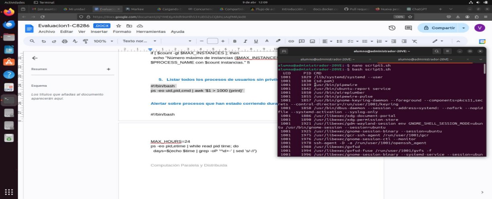
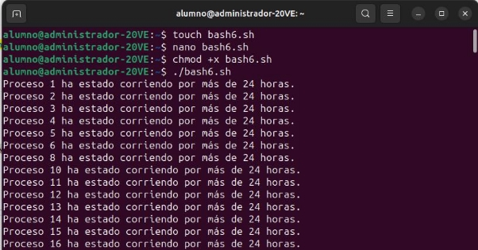
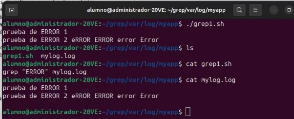
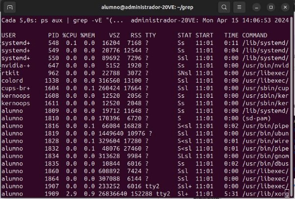
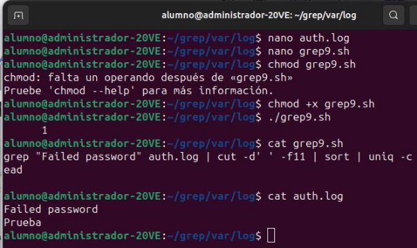
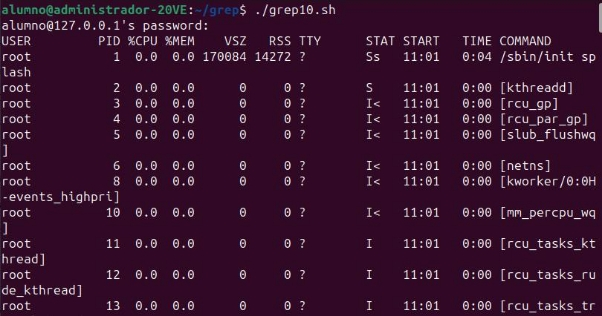
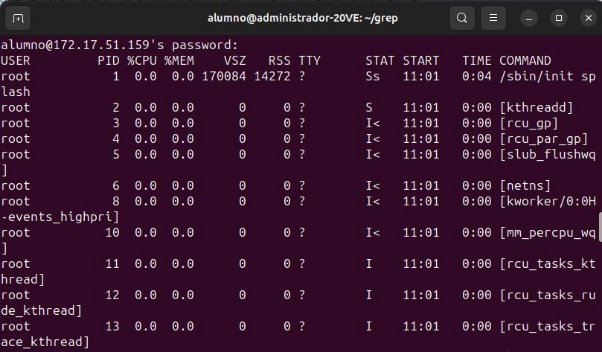

PARTE N°1 **El comando ps**

El comando **ps** en Linux y otros sistemas tipo Unix es una herramienta de línea de comandos utilizada para mostrar información sobre los procesos activos en un sistema. **ps** es el acrónimo de "process status" o estado del proceso. Proporciona una instantánea de los procesos corriendo en ese momento, incluyendo detalles como el ID del proceso (PID), el usuario propietario del proceso, el uso de CPU, el uso de memoria, el tiempo de ejecución, el comando que inició el proceso, entre otros.

En un curso de computación paralela, concurrente y distributiva, el comando **ps** puede ser aplicado de diversas maneras para facilitar la comprensión y gestión de los procesos y la ejecución de programas en estos entornos:

**Ejercicios**

1. Listar todos los procesos con detalles completos
1. Buscar procesos específicos por nombre:
1. Mostrar procesos en un árbol jerárquico (útil para ver relaciones padre-hijo en procesos concurrentes):
1. Mostrar procesos de un usuario específico:
1. Escribe un script para verificar y reiniciar automáticamente un proceso si no está corriendo.

En estos scripts (recuerda son archivos Bash, terminan en .sh) verifica que efectivamente hacen lo que se indica:

1. **Monitoreo de procesos por uso excesivo de CPU**

#!/bin/bash

ps -eo pid,ppid,%cpu,cmd --sort=-%cpu | head -10 | while read pid ppid cpu cmd; do

if (( $(echo "$cpu > 80.0" | bc -l) )); then

echo "Proceso $pid ($cmd) está utilizando $cpu% de CPU."

fi done

Este script de bash primero obtiene los 10 procesos con mayor uso de CPU. Luego para cada uno de estos procesos, verifica si el uso de CPU es mayor al 80%. Como en este caso no existe proceso mayor a 80% por ello no imprime nada.

2. **Identificar procesos zombis y reportar**

#!/bin/bash

ps -eo stat,pid,cmd | grep "^Z" | while read stat pid cmd; do

echo "Proceso zombi detectado: PID=$pid CMD=$cmd" done

Por lo tanto, este script detecta procesos zombis y reporta su PID y el comando que los inició. Un proceso zombi es un proceso que ha completado su ejecución pero aún tiene una entrada en la tabla de procesos, permitiendo que el proceso padre lea su estado de salida. En la mayoría de los casos, los procesos zombis no son problemáticos, pero si hay muchos pueden agotar la tabla de procesos.

El PID (ID de proceso) de este proceso zombi es 14846 y el comando que lo inició es [sd\_espeak-ng-mb]. El término <defunct> es otro indicador de que este proceso es un proceso zombi.

3. **Reiniciar automáticamente un servicio no está corriendo**

#!/bin/bash

SERVICE="apache2"

if ! ps -C $SERVICE > /dev/null; then

systemctl restart $SERVICE

echo "$SERVICE ha sido reiniciado." fi

Por lo tanto, si el servicio “apache2” no está en ejecución cuando se ejecuta este script, debería imprimir “apache2 ha sido reiniciado.”

4. **Verificar la cantidad de instancias de un proceso y actuar si supera un umbral**

#!/bin/bash

PROCESS\_NAME="httpd"

MAX\_INSTANCES=10

count=$(ps -C $PROCESS\_NAME --no-headers | wc -l) if [ $count -gt $MAX\_INSTANCES ]; then

echo "Número máximo de instancias ($MAX\_INSTANCES) superado para $PROCESS\_NAME con $count instancias." fi

El script que has escrito está diseñado para imprimir un mensaje solo cuando el número de instancias del proceso “httpd” supera el valor de MAX\_INSTANCES, que en tu caso es 10. Si no imprime nada, significa que el número de instancias de “httpd” es menor o igual a 10.

5. **Listar todos los procesos de usuarios sin privilegios (UID > 1000)**

#!/bin/bash

ps -eo uid,pid,cmd | awk '$1 > 1000 {print}'

Por lo tanto, este script imprimirá una lista de todos los procesos que están siendo ejecutados por usuarios con un UID mayor a 1000, lo que generalmente corresponde a usuarios sin privilegios en un sistema Linux. Cada línea de la salida incluirá el UID del usuario que está ejecutando el proceso, el PID del proceso y el comando que inició el proceso.

6. **Alertar sobre procesos que han estado corriendo durante más de X horas**

#!/bin/bash

MAX\_HOURS=24

ps -eo pid,etime | while read pid time; do

days=$(echo $time | grep -oP '^\d+-' | sed 's/-//') hours=$(echo $time | grep -oP '\d+:' | sed 's/://')

total\_hours=$((days \* 24 + hours))

if [ $total\_hours -gt $MAX\_HOURS ]; then

echo "Proceso $pid ha estado corriendo por más de $MAX\_HOURS horas." fi

done

Por lo tanto, este script imprimirá un mensaje para cada proceso que ha estado en ejecución durante más de 24 horas, indicando el PID del proceso y que ha estado en ejecución durante más de 24 horas. Si no hay procesos que hayan estado en ejecución durante más de 24 horas, el script no imprimirá nada.

7. **Encontrar y listar todos los procesos que escuchan en un puerto específico**

#!/bin/bash PORT="80"

lsof -i :$PORT | awk 'NR > 1 {print $2}' | while read pid; do ps

-p $pid -o pid,cmd

done

Por lo tanto, este script imprimirá una lista de todos los procesos que están escuchando en el puerto 80, indicando el PID del proceso y el comando que lo inició. Si no hay procesos que estén escuchando en el puerto 80, el script no imprimirá nada.

8. **Monitorear la memoria utilizada por un conjunto de procesos y alertar si supera un umbral**

#!/bin/bash PROCESS\_NAME="mysqld" MAX\_MEM=1024 # 1GB en MB

ps -C $PROCESS\_NAME -o pid,rss | while read pid rss; do if [ $rss -gt $MAX\_MEM ]; then

echo "Proceso $pid ($PROCESS\_NAME) está utilizando más de $MAX\_MEM MB de memoria."

fi done

Si el script no imprime nada, es posible que no haya ningún proceso “mysqld” que esté utilizando más de 1GB de memoria en tu sistema. El script está diseñado para imprimir un mensaje solo cuando encuentra un proceso que cumple con esa condición.

9. **Generar un informe de procesos que incluya PID, tiempo de ejecución y comando**

#!/bin/bash

ps -eo pid,etime,cmd --sort=-etime | head -20 > proceso\_informe.txt

echo "Informe generado en proceso\_informe.txt."

**El comando grep**

El comando **grep** es una herramienta de línea de comandos disponible en sistemas Unix y Linux utilizada para buscar texto dentro de archivos o flujos de datos. El nombre **grep** proviene de "global regular expression print", refiriéndose a su capacidad para filtrar líneas de texto que coinciden con expresiones regulares especificadas.

**Ejercicios**

En estos scripts (recuerda son archivos Bash, terminan en .sh) verifica que efectivamente hacen lo que se indica:

1. **Filtrar errores específicos en logs de aplicaciones paralelas:**

grep "ERROR" /var/log/myapp/\*.log

Por lo tanto, este comando imprimirá todas las líneas en todos los archivos de log de la aplicación en el directorio myapp/ que contienen la palabra “ERROR”. Esto puede ser útil para diagnosticar problemas con la aplicación al identificar errores específicos que se han registrado.

2. **Verificar la presencia de un proceso en múltiples nodos**:

pdsh -w nodo[1-10] "ps aux | grep 'my\_process' | grep -v grep"

Este comando imprimirá una lista de todos los procesos que contienen la cadena 'my\_process' en cada uno de los hosts nodo1 a nodo10. Si no hay tales procesos en un host, no se imprimirá nada para ese host. Si el proceso 'my\_process' está en ejecución en un host, se imprimirá la línea correspondiente de la salida de ps aux para ese proceso, que incluirá detalles como el ID del proceso (PID), el uso de la CPU y la memoria, el tiempo de inicio, el tiempo de CPU utilizado y el comando.

3. **Contar el número de ocurriencias de condiciones de carrera registradas**:

grep -c "race condition" /var/log/myapp.log

Este comando imprimirá el número de líneas en el archivo de log /var/log/myapp.log que contienen la frase “race condition”. Esto puede ser útil para diagnosticar problemas con una aplicación al identificar cuántas veces se ha registrado una condición de carrera. Si no hay líneas que contengan la frase “race condition”, el comando imprimirá “0”.

4. **Extraer IPs que han accedido concurrentemente a un recurso**:

grep "accessed resource" /var/log/webserver.log | awk '{print $1}' | sort | uniq

Este comando imprimirá una lista de direcciones IP únicas que han accedido a un recurso en el servidor web.

5. **Automatizar la alerta de sobrecarga en un servicio distribuido**:

grep "out of memory" /var/log/services.log && mail -s "Alerta de Memoria" admin@example.com < /dev/null

Este comando automatiza la alerta de sobrecarga de memoria en un servicio distribuido enviando un correo electrónico al administrador cuando se detecta una condición de “out of memory”.

6. **Monitorear errores de conexión en aplicaciones concurrentes**:

grep -i "connection error" /var/log/myapp\_error.log | mail -s "Errores de Conexión Detectados" <admin@example.com>

Este comando monitorea errores de conexión en aplicaciones concurrentes al buscar la frase “connection error” en el archivo de log de errores de la aplicación y enviar un correo electrónico al administrador con cualquier línea que contenga esa frase.

7. **Validar la correcta sincronización en operaciones distribuidas**:

grep "operation completed" /var/logs/distributed\_app/\*.log | awk '{print $5, $NF}' | sort

Este comando puede ayudar a validar la correcta sincronización en operaciones distribuidas al ordenar las operaciones completadas según los campos seleccionados.

8. **Monitorizar la creación de procesos no autorizados**

#!/bin/bash

watch -n 5 'ps aux | grep -vE "(root|daemon|nobody)" | grep -v grep'

Este comando monitorea la creación de procesos no autorizados al listar todos los procesos que no son ejecutados por los usuarios root, daemon o nobody.

9. **Detectar y alertar sobre ataques de fuerza bruta SSH**

grep "Failed password" /var/log/auth.log | cut -d' ' -f11 | sort | uniq -c | sort -nr | head

Este comando detecta y alerta sobre ataques de fuerza bruta SSH al listar las 10 principales direcciones IP desde las que se han producido los intentos de autenticación fallidos.

10. **Identificar uso no autorizado de recursos en clústeres de computación**

#!/bin/bash

for host in $(cat hosts.txt); do

ssh $host "ps aux | grep -vE '(ALLOWED\_PROCESS\_1|ALLOWED\_PROCESS\_2)' | grep -

v gr ep" done

Este comando identifica el uso no autorizado de recursos en clústeres de computación al listar todos los procesos no autorizados que se están ejecutando en cada host.
