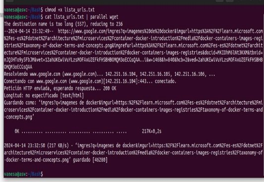
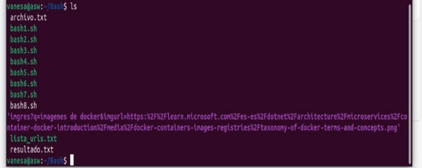
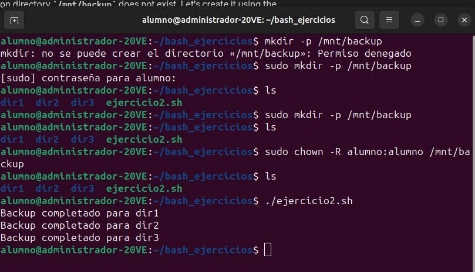
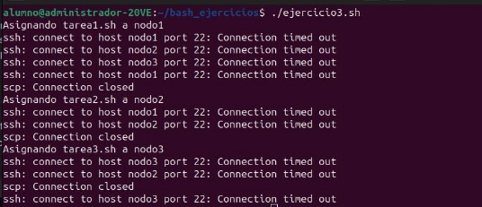
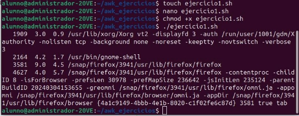

**Pipes**

Un "pipe" en Linux, simbolizado por |, es una poderosa característica de la línea de comandos que permite pasar la salida (output) de un comando directamente como entrada (input) a otro comando. Esto facilita la creación de secuencias de comandos o pipelines donde el resultado de un proceso es inmediatamente utilizado por otro, permitiendo una manipulación de datos eficiente y flexible sin necesidad de archivos intermedios.

**Ejercicios**

Indica las actividades que realizan cada uno de los scripts (recuerda son archivos Bash y por tanto terminan en .sh y cada línea representa un script diferente)

watch "ps aux | grep '[a]pache2' | awk '{print \$1, \$2, \$3, \$4, \$11}'"

Este comando imprimirá y actualizará continuamente una lista de todos los procesos apache2 en ejecución, mostrando el nombre del usuario, el ID del proceso, el uso de la CPU, el uso de la memoria y el comando para cada proceso. Si no hay procesos apache2 en ejecución, no se imprimirá nada.

cat /var/log/myapp.log | grep "ERROR" | awk '{print $NF}' | sort | uniq -c | sort -nr

Este comando imprimirá una lista de los mensajes de error en el archivo de log de la aplicación, ordenados por la frecuencia de ocurrencia, desde el más frecuente hasta el menos frecuente. Si no hay líneas que contengan la palabra “ERROR”, el comando no imprimirá nada

systemctl --failed | grep "loaded units listed" || systemctl restart $(awk '{print $1}')

Este comando verifica si hay unidades de systemd que han fallado. Si no hay unidades fallidas, el comando no hace nada. Si hay unidades fallidas, reinicia la primera unidad fallida que se encuentra.

3. ps -eo pid,ppid,%cpu,cmd --sort=-%cpu | awk '$3 > 80 {print "Alto uso de CPU: ", $1}' | mail -

s "Alerta CPU" [admin@example.com](mailto:admin@example.comcd)

Este comando monitorea el uso de la CPU por los procesos en ejecución. Si un proceso está utilizando más del 80% de la CPU, envía un correo electrónico con una alerta al administrador.

4. ls /var/log/\*.log | xargs -n 1 -P 5 -I {} ssh nodo\_remoto "grep 'ERROR' {} > errores\_{}.txt"

Este comando busca la cadena ‘ERROR’ en todos los archivos de log en el directorio /var/log/ y guarda las líneas que contienen ‘ERROR’ en archivos de texto en un nodo remoto.

5. echo "8.8.8.8 www.example.com" | xargs -n 1 ping -c 1 | grep "bytes from" || echo "$(date) Fallo de ping" >> fallos\_ping.txt

Este comando realiza un ping a la dirección IP 8.8.8.8 y al dominio www.example.com. Si alguno de los pings falla, registra la fecha y hora del fallo en un archivo llamado fallos\_ping.txt.

6. ps -eo user,%cpu,%mem,cmd | awk '/httpd/ {cpu+=$2; mem+=$3; count++} END {print "Apache - CPU:", cpu/count, "Mem:", mem/count}'

   Este comando calcula y muestra el uso promedio de CPU y memoria de todos los procesos httpd (Apache) en ejecución.

7. df /home | awk '$5 > 80 {print $1}' | xargs -I {} tar -czf "{}\_$(date +%F).tar.gz" {}

Este comando verifica si el uso del disco del directorio /home es superior al 80%. Si es así, crea un archivo tar comprimido con gzip del directorio.

8. **Monitoreo de uso de CPUporproceso (Python)**

import subprocess

- Ejecutar el comando ps y obtener la salida

result = subprocess.run(['ps', '-eo', '%cpu,pid,cmd'], stdout=subprocess.PIPE) lines = result.stdout.decode('utf-8').strip().split('\n')

- Analizar cada línea de la salida de ps

for line in lines[1:]: # Saltar la primera línea que es la cabecera

cpu\_usage, pid, cmd = line.split(None, 2)

if float(cpu\_usage) > 80.0: # Umbral de uso de CPU

print(f"Alerta: Proceso {pid} ({cmd}) está utilizando {cpu\_usage}% de CPU")

- Ejecuta el comando ps para obtener una lista de procesos con su uso de CPU.
- Analiza cada línea de la salida.
- Si el uso de CPU de un proceso supera el 80%, imprime una alerta con el PID y el nombre del proceso.
9. **Filtrarlíneas de errorde un archivo de log (Python)**

import subprocess

- Filtrar líneas con errores de un archivo de log cmd = "grep 'ERROR' /var/log/myapp.log"

  errors = subprocess.check\_output(cmd, shell=True).decode('utf-8').split('\n')

- Analizar errores y contar ocurrencias error\_counts = {}

for error in errors:

if error in error\_counts: error\_counts[error] += 1

else: error\_counts[error] = 1

- Imprimir el recuento de errores for error, count in error\_counts.items(): print(f"{error}: {count}")

- Utiliza grep para filtrar las líneas que contienen la palabra "ERROR" de un archivo de log.
- Cuenta las ocurrencias de cada línea de error.
- Imprime un recuento de cada línea de error

**10.Analizararchivo de log grande en paralelo (Python)**

from multiprocessing import Pool import subprocess

def analyze\_log(file\_part):

"""Función para analizar una parte del archivo de log.""" with open(file\_part) as f:

return f.read().count('ERROR')

- Dividir el archivo de log en partes

subprocess.run(['split', '-l', '1000', 'large\_log.log', 'log\_part\_'])

- Lista de archivos divididos

parts = subprocess.check\_output('ls log\_part\_\*', shell=True).decode().split()

- Utilizar multiprocessing para analizar las partes en paralelo with Pool(4) as p:

results = p.map(analyze\_log, parts)

print("Total de errores encontrados:", sum(results))

- Divide un archivo de log grande en partes más pequeñas.
- Utiliza multiprocessing para analizar cada parte en paralelo, contando las líneas que contienen "ERROR".
- Imprime el total de errores encontrados en todo el archivo.

**11.Monitoreo de cambios en puertos abiertos (Python)** import subprocess

import time

previous\_ports = set()

while True:

- Ejecutar netstat y capturar la salida

result = subprocess.run(['netstat', '-tuln'], stdout=subprocess.PIPE)

ports = set(line.split()[3] for line in result.stdout.decode().split('\n') if 'LISTEN' in line)

- Detectar cambios en puertos abiertos new\_ports = ports - previous\_ports closed\_ports = previous\_ports - ports

  if new\_ports or closed\_ports:

  print(f"Nuevos puertos abiertos: {new\_ports}, Puertos cerrados: {closed\_ports}") previous\_ports = ports

  time.sleep(60) # Esperar un minuto antes de volver a verificar

- Ejecuta netstat periódicamente para obtener una lista de puertos abiertos.
- Detecta si hay nuevos puertos abiertos o puertos cerrados desde la última ejecución.
- Imprime los puertos abiertos y cerrados.

**12.Cálculo de uso de memoria por usuario (Python)**

import subprocess

- Obtener uso de memoria por proceso

result = subprocess.run(['ps', '-eo', 'user,rss'], stdout=subprocess.PIPE) lines = result.stdout.decode().split('\n')

- Calcular el uso total de memoria por usuario

memory\_usage = {}

for line in lines[1:-1]: # Ignorar la primera y última línea (cabecera y línea vacía)

user, rss = line.split(None, 1)

memory\_usage[user] = memory\_usage.get(user, 0) + int(rss)

- Imprimir el uso de memoria por usuario

for user, rss in memory\_usage.items():

print(f"Usuario: {user}, Memoria RSS total: {rss} KB")

- Ejecuta ps para obtener el uso de memoria RSS de cada proceso.
- Calcula el uso total de memoria por usuario.
- Imprime el uso total de memoria para cada usuario.

**13.Registro de uso de CPUy memoria (Python)**

import subprocess

import datetime

snapshot\_interval = 60 # en segundos

while True:

timestamp = datetime.datetime.now().strftime('%Y-%m-%d %H:%M:%S')

cpu\_usage = subprocess.check\_output("top -b -n1 | awk '/Cpu\(s\):/ {print $2}'", shell=True).decode().strip()

memory\_usage = subprocess.check\_output("free | grep Mem | awk '{print $3/$2 \*100.0}'", shell=True).decode().strip()

with open("system\_performance.log", "a") as log\_file:

log\_file.write(f"{timestamp}, CPU: {cpu\_usage}%, Memoria: {memory\_usage}%\n")

time.sleep(snapshot\_interval)

- Captura el uso de CPUy memoria cada 60 segundos.
- Registra la marca de tiempo, uso de CPU y uso de memoria en un archivo de registro.

**14.Monitoreo de uso excesivo de CPU y envío de alerta por correo (Bash)**

#!/bin/bash

while true; do

ps -eo %cpu,pid,cmd --sort=-%cpu | head -n 10 | awk '$1 > 80.0 { printf("Alto uso de CPU (%s%%) por PID %s: %s\n", $1, $2, $3); }' | while read LINE; do

echo "$LINE" | mail -s "Alerta de CPU" admin@domain.com

done

sleep 60

done

- Monitorea los 10 procesos con mayor uso de CPU.
- Si algún proceso supera el 80% de uso de CPU, envía una alerta por correo electrónico.
- Se ejecuta en un bucle indefinido cada 60 segundos.

**15.Uso de memoria por usuario (Bash)**

#!/bin/bash

ps -eo user,rss | awk '{arr[$1]+=$2} END {

for (user in arr) {

print user, arr[user] " KB";

}

}' | sort -nrk 2 > /tmp/memory\_usage\_by\_user.txt

echo "Uso de memoria por usuario guardado en /tmp/memory\_usage\_by\_user.txt."

- Ejecuta ps para obtener el uso de memoria RSS de cada proceso.
- Calcula el uso total de memoria por usuario.
- Imprime el uso de memoria por usuario en un archivo.

**16.Reporte de uso de CPU y memoria por usuario (Bash)**

#!/bin/bash

echo "Top CPU y Memoria por Usuario"

ps -eo user,%cpu,%mem --sort=-%cpu | awk 'NR==1 {print $0; next} !seen[$1]++' | while read USER CPU MEM; do

echo "Usuario: $USER, CPU: $CPU%, Mem: $MEM%"

done

- Ejecuta ps para obtener el uso de CPU y memoria de cada proceso.
- Agrupa los procesos por usuario y muestra el uso de CPU y memoria para cada usuario.

**17.Reporte de memoria para procesos específicos (Bash)**

#!/bin/bash

PROCESS\_NAME="java"

echo "Reporte de Memoria para procesos $PROCESS\_NAME"

ps -C $PROCESS\_NAME -o pid,user,%mem,cmd --sort=-%mem | awk 'NR==1; NR>1 {print $0; total+=$3} END {print "Memoria Total Usada:", total "%"}'

- Toma el nombre de un proceso como entrada.
- Ejecuta ps para obtener el uso de memoria de los procesos con ese nombre.
- Imprime el PID, usuario, uso de memoria y comando para cada proceso.
- Calcula y muestra el uso total de memoria para esos procesos.

**18.Top IPs en un archivo de log (Bash)** #!/bin/bash

LOG="/var/log/httpd/access\_log"

echo "Top IPs"

awk '{print $1}' $LOG | sort | uniq -c | sort -nr | head -5 | while read COUNT IP; do

LOCATION=$(geoiplookup $IP | cut -d, -f2)

echo "$IP ($COUNT accesos) - $LOCATION"

done

- Toma un archivo de log como entrada (en este caso, /var/log/httpd/access\_log).
- Cuenta las ocurrencias de cada dirección IP en el archivo de log.
- Imprime las 5 direcciones IP con más accesos, junto con su recuento y ubicación geográfica aproximada.

**19.Estadísticas de tasa de transferencia de red (Bash)**

#!/bin/bash

NET\_DEV="eth0" #aquí cambio

echo "Estadísticas de red para $NET\_DEV"

rx\_prev=$(cat /sys/class/net/$NET\_DEV/statistics/rx\_bytes) tx\_prev=$(cat /sys/class/net/$NET\_DEV/statistics/tx\_bytes) sleep 5

rx\_now=$(cat /sys/class/net/$NET\_DEV/statistics/rx\_bytes) tx\_now=$(cat /sys/class/net/$NET\_DEV/statistics/tx\_bytes) rx\_rate=$(( ($rx\_now - $rx\_prev) / 5 ))

tx

- Toma el nombre de un dispositivo de red como entrada (en este caso, eth0).
- Lee los bytes recibidos y transmitidos en un intervalo de 5 segundos.
- Calcula y muestra la tasa de transferencia de recepción y transmisión en bytes/segundo.

**Bash**

Para profundizar en el aprendizaje y comprensión de Bash en el contexto de computación paralela, concurrente y distribuida, necesitarán una base sólida en varios conceptos y herramientas de línea de comandos. A continuación, les presento una lista de referencias y recursos que pueden ser útiles permitiéndoles no solo entender los scripts proporcionados aquí, sino también desarrollar sus propios scripts para resolver problemas complejos en estos entornos.

"The Linux Command Line" por William Shotts <https://linuxcommand.org/tlcl.php>

**Departamento Académico de Ingeniería C8286-Computación Paralela y Distribuida**

**Variables**: Almacenar y manipular datos.

nombre="Mundo" echo "Hola, $nombre"

**Estructuras de Control**: Permiten tomar decisiones y repetir acciones.

- If statement

if [ "$nombre" == "Mundo" ]; then

echo "Correcto" fi

- Loop

for i in {1..5}; do

echo "Iteración $i" done

**Funciones**: Agrupar código para reutilizar. saludo() {

echo "Hola, $1"

}

saludo "Mundo"

**Comandos comunes** (**grep**, **awk**, **sed**, **cut**, **sort**, **uniq**): Procesamiento de texto y datos. echo -e "manzana\nbanana\nmanzana" | sort | uniq

**Pipes y redirecciones**: Conectar la salida de un comando con la entrada de otro. cat archivo.txt | grep "algo" > resultado.txt

**Expresiones regulares**: Patrones para buscar y manipular texto. echo "error 404" | grep -Eo "[0-9]+"

**Manejo de argumentos**: Scripts que aceptan entrada del usuario.

#!/bin/bash

echo "Ejecutando script con el argumento: $1"

**Automatización y monitoreo**: Scripts para automatizar tareas y monitorear sistemas. #!/bin/bash

if ps aux | grep -q "[a]pache2"; then

echo "Apache está corriendo."

else

echo "Apache no está corriendo." fi

**Procesamiento Paralelo con GNU Parallel**: Ejecutar tareas en paralelo para optimizar el tiempo de procesamiento.

cat lista\_urls.txt | parallel wget

**Validación de entradas**: Prevenir la ejecución de comandos maliciosos. read -p "Introduce tu nombre: " nombre

echo "Hola, $nombre" # Asegúrate de validar o escapar $nombre si se usa en comandos más complejos.

**Optimización de scripts**: Utilizar herramientas y técnicas para reducir el tiempo de ejecución.

find . -name "\*.txt" | xargs grep "patrón"

No encuentra ningún patron. **Ejercicios**

Indica las actividades que realizan cada uno de los scripts (recuerda son archivos Bash y por tanto terminan en .sh.

1. Monitoreo de procesos y terminación de procesos con alto uso de recursos: #!/bin/bash
- Configuración

UMBRAL\_CPU=70.0 # Uso máximo de CPU permitido (%) UMBRAL\_MEM=500 # Uso máximo de memoria permitido (MB) LOG\_FILE="/var/log/monitoreo\_procesos.log" EMAIL\_ADMIN="admin@ejemplo.com"

PROCESOS\_PARALELOS=("proceso1" "proceso2" "proceso3") # Nombres de los procesos a monitorear

- Función para convertir memoria de KB a MB convertir\_kb\_a\_mb() {

echo "$(( $1 / 1024 ))"

}

- Función para obtener y verificar el uso de recursos de los procesos verificar\_procesos() {

for PROC in "${PROCESOS\_PARALELOS[@]}"; do

ps -C $PROC -o pid=,%cpu=,%mem=,vsz=,comm= --sort=-%cpu | while read PID CPU MEM VSZ COMM; do

MEM\_MB=$(convertir\_kb\_a\_mb $VSZ)

if (( $(echo "$CPU > $UMBRAL\_CPU" | bc -l) )) || [ "$MEM\_MB" -gt "$UMBRAL\_MEM" ]; then

echo "$(date +"%Y-%m-%d %H:%M:%S") - Proceso $COMM (PID $PID) excede los umbrales con CPU: $CPU%, MEM: ${MEM\_MB}MB" >> $LOG\_FILE

kill -9 $PID && echo "$(date +"%Y-%m-%d %H:%M:%S") - Proceso $PID terminado." >> $LOG\_FILE

echo "Proceso $PID ($COMM) terminado por alto uso de recursos" | mail -s "Alerta de Proceso Terminado" $EMAIL\_ADMIN

fi

done

done

}

- Loop principal para el monitoreo continuo

while true; do

verificar\_procesos

sleep 60 # Espera 60 segundos antes de la próxima verificación done

Este script monitorea continuamente el uso de CPU y memoria de los procesos especificados en PROCESOS\_PARALELOS. Si algún proceso excede los umbrales configurados (UMBRAL\_CPU y UMBRAL\_MEM), el script registra un mensaje en el archivo de registro (LOG\_FILE) y termina el proceso. Además, envía un correo electrónico al administrador

(EMAIL\_ADMIN) informando sobre el proceso terminado.

2. Respaldo de directorios:

   #!/bin/bash

   DIRECTORIOS=("dir1" "dir2" "dir3") DESTINO\_BACKUP="/mnt/backup"

   backup\_dir() {

dir=$1

fecha=$(date +%Y%m%d)

tar -czf "${DESTINO\_BACKUP}/${dir##\*/}\_$fecha.tar.gz" "$dir" echo "Backup completado para $dir"

}

export -f backup\_dir

export DESTINO\_BACKUP

parallel backup\_dir ::: "${DIRECTORIOS[@]}"

Este script realiza un respaldo de los directorios especificados en DIRECTORIOS utilizando el comando tar. Los archivos comprimidos de respaldo se crean en el directorio DESTINO\_BACKUP con un nombre que incluye el nombre del directorio y la fecha actual. La función backup\_dir es exportada y luego se utiliza parallel para ejecutar la función en paralelo para cada directorio

3. Distribución de tareas en nodos:

   #!/bin/bash

   NODOS=("nodo1" "nodo2" "nodo3") TAREAS=("tarea1.sh" "tarea2.sh" "tarea3.sh")

   distribuir\_tareas() {

for i in "${!TAREAS[@]}"; do

nodo=${NODOS[$((i % ${#NODOS[@]}))]} tarea=${TAREAS[$i]}

echo "Asignando $tarea a $nodo"

scp "$tarea" "${nodo}:/tmp"

ssh "$nodo" "bash /tmp/$tarea" &

done

wait

} distribuir\_tareas

Este script distribuye un conjunto de tareas (scripts de Bash) en varios nodos. Primero, copia cada tarea en el directorio /tmp del nodo correspondiente utilizando scp. Luego, ejecuta cada tarea en el nodo correspondiente mediante ssh. Las tareas se distribuyen de forma circular entre los nodos disponibles.

4. Bloqueo y acceso a un recurso compartido:

#!/bin/bash

LOCK\_FILE="/var/lock/mi\_recurso.lock" RECURSO="/path/to/recurso\_compartido"

adquirir\_lock() {

while ! (set -o noclobber; > "$LOCK\_FILE") 2> /dev/null; do

echo "Esperando por el recurso..."

sleep 1

done

}

liberar\_lock() {

rm -f "$LOCK\_FILE"

} adquirir\_lock

- Trabajar con el recurso echo "Accediendo al recurso" sleep 5 # Simular trabajo liberar\_lock

Este script implementa un mecanismo de bloqueo para acceder a un recurso compartido. La función adquirir\_lock intenta crear un archivo de bloqueo (LOCK\_FILE) de forma exclusiva. Si el archivo ya existe, el script esperará hasta poder crear el archivo. Una vez que se adquiere el bloqueo, el script puede acceder y trabajar con el recurso compartido (RECURSO). Finalmente, la función liberar\_lock elimina el archivo de bloqueo para permitir que otros procesos accedan al recurso.

5. Recolección de métricas de nodos:

#!/bin/bash

NODOS=("nodo1" "nodo2" "nodo3") ARCHIVO\_METRICAS="/tmp/metricas\_$(date +%Y%m%d).csv"

recolectar\_metricas() {

echo "Nodo,CPU(%),Memoria(%),Disco(%)" > "$ARCHIVO\_METRICAS"

for nodo in "${NODOS[@]}"; do

ssh "$nodo" "

cpu=\$(top -bn1 | grep 'Cpu(s)' | sed 's/.\*,\s\*\([0-9.]\*\)%\* id.\*/\1/' | awk '{print 100 - \$1}'); memoria=\$(free | awk '/Mem:/ {print \$3/\$2 \* 100.0}');

disco=\$(df / | awk 'END{print \$(NF-1)}');

echo \"\$HOSTNAME,\$cpu,\$memoria,\$disco\";

" >> "$ARCHIVO\_METRICAS"

done

} recolectar\_metricas

Este script recolecta métricas de uso de CPU, memoria y disco de varios nodos y las almacena en un archivo CSV (ARCHIVO\_METRICAS). Se conecta a cada nodo mediante ssh y ejecuta comandos para obtener las métricas deseadas. Luego, agrega una línea con el nombre del nodo y las métricas correspondientes al archivo CSV.

**awk**

Awk es una herramienta de scripting extremadamente poderosa y versátil para procesar y analizar datos en Unix/Linux. Es especialmente útil para manipular datos textuales y produce resultados formatados. **awk** funciona leyendo archivos o flujos de entrada línea por línea, dividiendo cada línea en campos, procesándola con acciones definidas por el usuario y luego imprimiendo la salida.

**awk** puede ser usado para extraer información específica de la lista de procesos generada por el comando **ps**.

ps aux | awk '{print $1, $2, $3, $4, $11}' | head -n 10

Pregunta: ¿Qué hace y cual es el resultado del código anterior?

Este comando muestra los primeros 10 procesos del sistema, mostrando sólo los campos de usuario (usuario que ejecuta el proceso), PID (ID del proceso), %CPU (uso de CPU), %MEM

(uso de memoria) y la línea de comando del proceso.

**awk** puede ser utilizado para preparar y filtrar datos que necesiten ser procesados en paralelo. Por ejemplo, puedes dividir un archivo grande en múltiples archivos más pequeños basados en algún criterio, que luego pueden ser procesados en paralelo:

awk '{print > ("output" int((NR-1)/1000) ".txt")}' input.txt

Pregunta: Comprueba con este archivo de texto el anterior script:

<https://babel.upm.es/~angel/teaching/pps/quijote.txt>

Este script divide un archivo de entrada grande (input.txt) en múltiples archivos de salida más pequeños (output0.txt, output1.txt, output2.txt, etc.). Cada archivo de salida contendrá 1000 líneas del archivo de entrada.

La combinación de **awk** con pipes y expresiones regulares expande significativamente sus capacidades de procesamiento de texto. Por ejemplo, para monitorizar archivos de log en busca de errores y filtrar mensajes relevantes:

tail -f /var/log/app.log | grep "ERROR" | awk '{print $1, $2, $NF}'

Este comando monitorea un archivo de registro (/var/log/app.log) en tiempo real y filtra las líneas que contienen la palabra "ERROR". Luego, utilizando awk, imprime el primer campo ($1), el segundo campo ($2) y el último campo ($NF) de cada línea filtrada.

ps -eo user,pid,pcpu,pmem,cmd | grep apache2 | awk '$3 > 50.0 || $4 > 50.0 {print "Alto recurso: ", $0}'

Este comando muestra los procesos de Apache2 que tienen un uso de CPU superior al 50% o un uso de memoria superior al 50%.

**Ejercicios:**

¿Cuál es la salida de los siguientes scripts (recuerda que son archivos de texto en bash)

1. ps -eo pid,pcpu,pmem,cmd | awk '$2 > 10.0 || $3 > 10.0'

Este comando muestra los procesos que tienen un uso de CPU mayor al 10% o un uso de memoria mayor al 10%.

2. awk '{print $0 >> ("output-" $4 ".log")}' /var/log/syslog

n

Este script divide las líneas del archivo /var/log/syslog en múltiples archivos de registro (output-$4.log) basados en el cuarto campo ($4) de cada línea.

3. grep "Failed password" /var/log/auth.log | awk '{print $(NF-3)}' | sort | uniq -c | sort -nr

Este comando analiza el archivo /var/log/auth.log y cuenta el número de intentos fallidos de inicio de sesión por dirección IP.

4. inotifywait -m /path/to/dir -e create | awk '{print "Nuevo archivo creado:", $3}'

Nuevo archivo creado: archivo1.txt Nuevo archivo creado: archivo2.pdf Nuevo archivo creado: archivo3.jpg

Este script utiliza inotifywait para monitorear un directorio (/path/to/dir) y detectar cuando se crea un nuevo archivo. Luego, a través de un pipe (|), envía la salida a awk, que imprime la cadena "Nuevo archivo creado:" seguida del nombre del archivo recién creado ($3).

5. find . -type f -name "\*.py" -exec ls -l {} + | awk '{sum += $5} END {print "Espacio total usado por archivos .py: ", sum}' \*

Este script utiliza find para buscar todos los archivos con extensión .py en el directorio actual y subdirectorios. Luego, ejecuta ls -l en esos archivos y canaliza la salida a awk.

6. awk '{sum+=$NF} END {print "Tiempo promedio de respuesta:", sum/NR}' access.log

Este script procesa un archivo de registro de acceso (access.log) y calcula el tiempo promedio de respuesta. Asume que el último campo ($NF) de cada línea es el tiempo de respuesta. awk suma todos los tiempos de respuesta (sum+=$NF) y, al final (END), divide la suma total por el número de líneas (NR) para obtener el promedio.

7. ps -eo state | awk '/D/ {d++} /R/ {r++} END {print "Espera (D):", d, "- Ejecución (R):", r}'\*

Este script usa ps -eo state para obtener el estado de todos los procesos en ejecución. Luego, awk analiza la salida y cuenta el número de procesos en estado de espera (/D/ {d++}) y en ejecución (/R/ {r++}). Al final (END), imprime el recuento de cada estado.

8. ps -eo state | awk '/D/ {d++} /R/ {r++} END {print "Espera (D):", d, "- Ejecución (R):", r}'

Este script es idéntico al anterior, pero sin el \\* al final. Imprime el recuento de procesos en espera y ejecución.

9. awk '/SwapTotal/ {total=$2} /SwapFree/ {free=$2} END {if ((total-free)/total\*100 >

   20\.0) print "Alerta: Uso excesivo de swap"}' /proc/meminfo

Alerta: Uso excesivo de swap

Este script analiza el archivo /proc/meminfo y verifica si el uso de la memoria de intercambio (swap) es excesivo. Busca las líneas que comienzan con "SwapTotal" y "SwapFree", y asigna los valores correspondientes a las variables total y free. Al final (END), calcula el porcentaje de uso de swap como ((total-free)/total\*100) y, si es mayor al 20%, imprime un mensaje de alerta.

10. ls -l | awk '!/^total/ && !/^d/ {sum += $5} END {print "Uso total de disco (sin subdirectorios):", sum}'

Este script utiliza ls -l para obtener una lista detallada de archivos y directorios en el directorio actual. La salida se canaliza a awk. awk filtra las líneas que no comienzan con "total" (!/^total/) y que no son directorios (!/^d/), luego suma el tamaño de cada archivo (sum += $5, donde $5 es el tamaño del archivo en bytes). Al final (END), imprime el uso total de disco de los archivos, excluyendo los subdirectorios.
